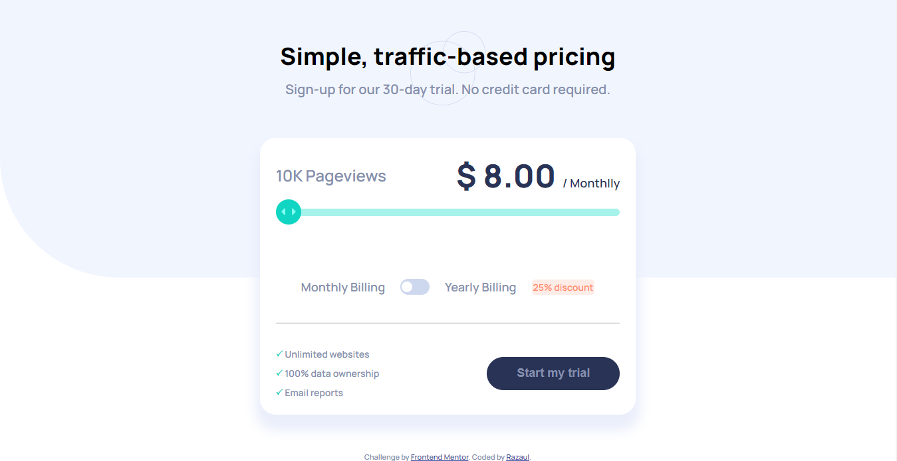

# Frontend Mentor - Interactive pricing component solution

This is a solution to the [Interactive pricing component challenge on Frontend Mentor](https://www.frontendmentor.io/challenges/interactive-pricing-component-t0m8PIyY8). Frontend Mentor challenges help you improve your coding skills by building realistic projects.

## Table of contents

- [Overview](#overview)
  - [The challenge](#the-challenge)
  - [Screenshot](#screenshot)
  - [Links](#links)
- [My process](#my-process)
  - [Built with](#built-with)
  - [What I learned](#what-i-learned)
  - [Continued development](#continued-development)
  - [Useful resources](#useful-resources)
- [Author](#author)
- [Acknowledgments](#acknowledgments)

## Overview

### The challenge

Users should be able to:

- View the optimal layout for the app depending on their device's screen size
- See hover states for all interactive elements on the page
- Use the slider and toggle to see prices for different page view numbers

### Screenshot

### Links

- Solution URL: [Add solution URL here](https://your-solution-url.com)
- Live Site URL: [https://interactive-pricing-razaul.netlify.app/]()

## My process

### Built with

- Semantic HTML5 markup
- CSS custom properties
- Flexbox
- CSS Grid
- Desktop-first workflow
- [JQuery](https://jquery.com/)
-

### Continued development

code optimization is not completed fully. i will work on it later .

### Useful resources

- [Example resource 1](https://www.jquery.com)
- [Example resource 2](https://www.w3school.com)

## Author

- Website - [My github profile ](https://www.github.com/Razaul00003)
- Frontend Mentor - [Razaul00003](https://www.frontendmentor.io/profile/Razaul00003)

## Acknowledgments

This challenge was very interesting , initally i thought it is very simple projects , could take some minutes, but when doing this , i noticed the weekness of knowledge. Thank you the creator of this challenge and also frontend mentor.
